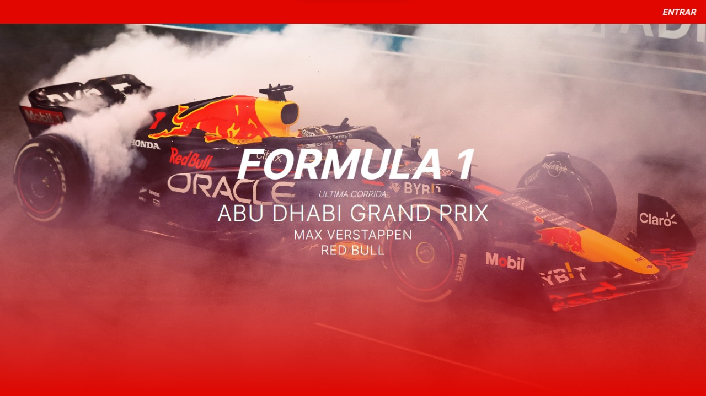
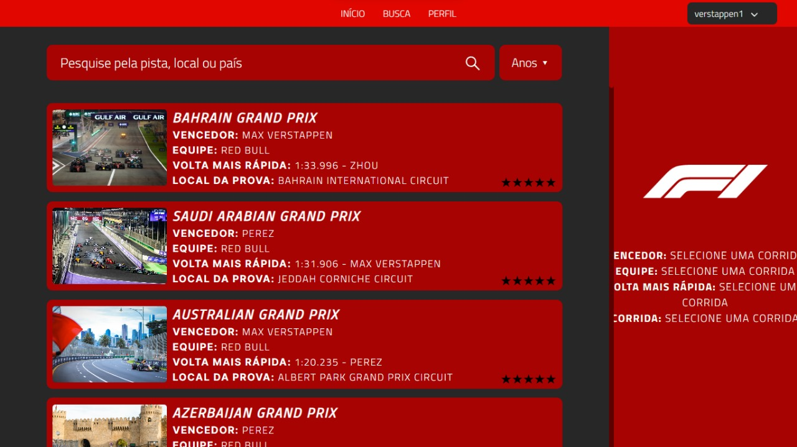
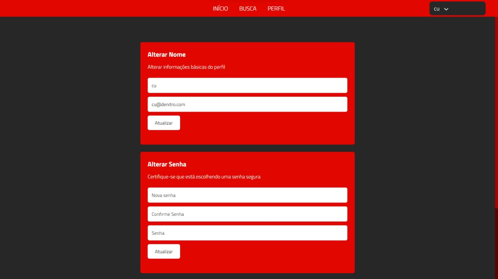
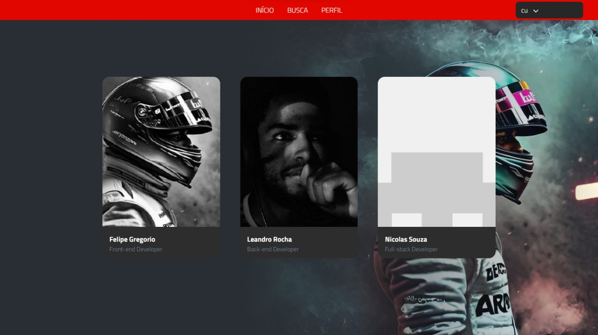

# Formulinho

## Trabalho Final de XDES03 - Programação Web 

> Explore o mundo das corridas de Fórmula 1 em nosso site, podendo explorar todas as corridas, e avalia-las.

Nosso projeto é focado em mostrar todas as corridas de Fórmula 1 desde 1950, filtradas por ano. Cada corrida será apresentada em formato de cartão com várias informações. Além disso, os usuários terão a possibilidade de avaliar cada corrida, e essas informações serão armazenadas no banco de dados. O projeto é composto por seis páginas, divididas em autenticação, pesquisa e edição.

## Pagina Inicial

## Login

## Registro

## Pesquisar corridas

## Perfil 

## Sobre

# Participantes:

Back-end:

[Leandro Rocha Liberato Gonçalves](https://github.com/LeandroRochAlg)  

Front-end:

[Felipe Alves Gregorio](https://github.com/flp-gregorio) 

[Nícolas de Souza Moreira](https://github.com/NSMoreira145) 
